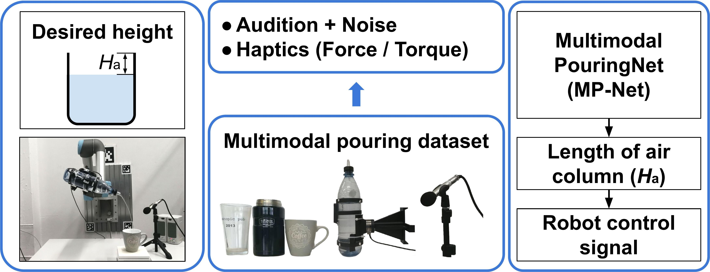
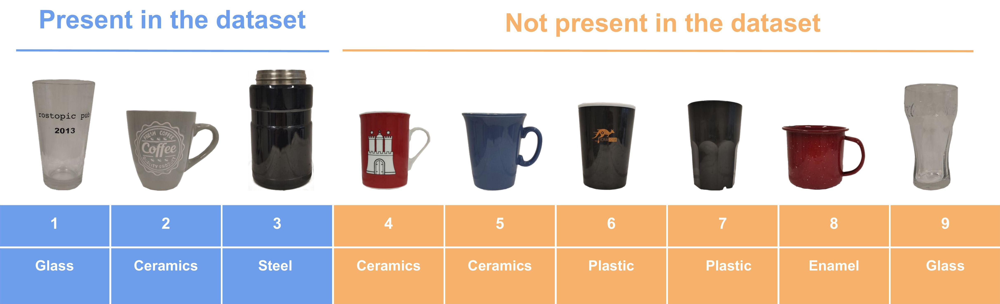
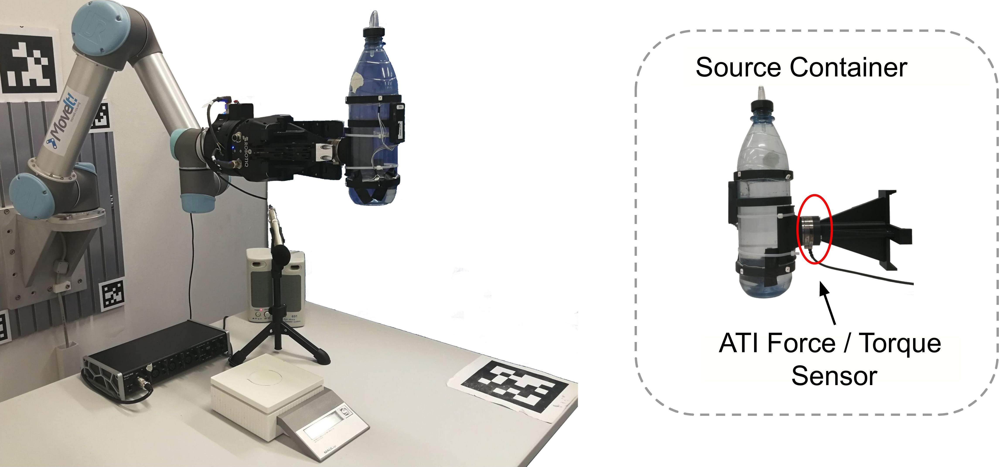
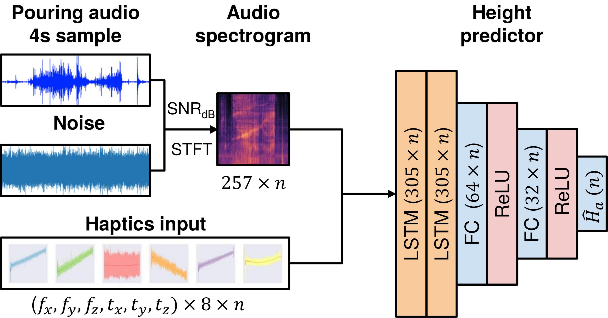

# Multimodal Pouring
In this paper, we focus on the robust and accurate estimation of liquid height for robotic pouring. However, vision-based methods often fail in occluded conditions while audio-based methods cannot work well in a noisy environment. We instead propose a multimodal pouring network (MP-Net) that is able to robustly predict liquid height by conditioning on both audition and haptics input. MP-Net is trained on a self-collected multimodal pouring dataset. This dataset contains 300 robot pouring recordings with audio and force/torque measurements for three types of target containers. We also augment the audio data by inserting robot noise. We evaluated MP-Net on our collected dataset and a wide variety of robot experiments. Both network training results and robot experiments demonstrate that MP-Net is robust against noise and changes to the task and environment. Moreover, we further combine the predicted height and force data to estimate the shape of the target container.

- Project website: https://lianghongzhuo.github.io/MultimodalPouring/
- Preprint: https://arxiv.org/abs/2003.00342
- Video: https://youtu.be/_U7zTyS338I

## Overview
<div style="text-align:center">

</div>

## Target containers
<div style="text-align:center">

</div>

## Dataset and experiment setup
<div style="text-align:center">

</div>

Please contact Hongzhuo Liang (liang[at]informatik.uni-hamburg.de) for the download link.

## Network
<div style="text-align:center">

</div>


## Installation
1. Install [Anaconda](https://www.anaconda.com/download/#linux) and [PyTorch](https://pytorch.org/):

1. Install python packages in a new environment
    ```bash
    conda upgrade --all
    conda create -n pouring python=[PYTHON_VERSION] numpy ipython matplotlib mayavi yaml lxml seaborn pyyaml
    conda activate pouring
    conda install -c conda-forge librosa trimesh pyglet
    conda install -c conda-forge "h5py>=2.9=mpi*"
    pip install rospkg numpy-stl tensorboardx pyquaternion pyassimp==4.1.3
    ```
    Note: PYTHON_VERSION can be 3.7 if you do not need to use this package with ROS, otherwise use 2.7 or use python at `/usr/bin/python`

1. Clone and install this repository:
    ```bash
    git clone https://github.com/lianghongzhuo/MultimodalPouring.git
    cd MultimodalPouring
    MP_POURING_DIR=${PWD}
    cd audio_pouring
    python setup.py develop
    ```

1. Install dependencies:
    - Install portaudio dependencies:  according to [this](https://ubuntuforums.org/showthread.php?t=1680154),
    install packages in this order will not remove any other packages
        ```bash
        sudo apt install libsndfile1-dev
        sudo apt install libjack-jackd2-dev
        sudo apt install portaudio19-dev
        ```
    - Make sure your current user name is in `audio` group
    - Other dependencies (only for robot experiment):
        ```bash
        cd ${MP_POURING_DIR}
        sh audio_pouring_install.sh
        ```

1. Install following required ROS packages:
- [portaudio_transport](https://github.com/lianghongzhuo/portaudio_transport.git)

## Run demo
1. Bring up audio publishing node:

    ```bash
    roslaunch portaudio_transport publish.launch
    ```
1. Bring up the Force/Torque sensor

1. Bring up a scale to get the ground truth height, if you do not have a ROS based scale, directly go to step 4.

1. Run demo code

    ```bash
    cd ${MP_POURING_DIR}/audio_pouring
    python demo.py --cuda --bottle=1 --cavity-height=50 --multi --scale
    ```
1. (In case when a ROS-based scale is not available) you can also use a normal scale and check the pouring result with the code below:
    ```python
    from audio_pouring.utils.utils import weight2height
    print(weight2height(cup_id="1", cur_weight=0.02))
    ```

## Network Training
1. Data preparation: generate a 4s segment from a whole pouring sequence (pickle files):
    ```bash
    cd ${MP_POURING_DIR}/audio_pouring/model
    ./run_long_preprocess.sh
    ```

1. Network training
    ```bash
    cd ${MP_POURING_DIR}/audio_pouring
    # run
    ./run_network_multi.sh
    # or 
    ./run_network_audio.sh
    # args:
    # --multi       : use multi modal date or audio only
    # --lstm        : set to use lstm or gru
    # --bs          : set batch size
    # --bottle-train: set bottle id, should set to robot_pouring
    # --snr_db      : set snr_db value (1000 means no noise, -1000 means mixed noise from 0 to 20)
    ```

## Generate your own bottle config file
- create a bottle config csv file and put it at `${MP_POURING_DIR}/audio_pouring/config/bottles`
- modify and run the code below:
    ```bash
    cd ${MP_POURING_DIR}/audio_pouring/utils
    python generate_bottle_config.py
    ```

## Citation
If you find this paper and code useful in your research, please consider citing:

```plain
@article{liang2020MultimodalPouring,
title={Robust Robotic Pouring using Audition and Haptics},
author={Liang, Hongzhuo and Zhou, Chuangchuang and Li, Shuang and Ma, Xiaojian and Hendrich, Norman and Gerkmann, Timo and Sun, Fuchun and Zhang, Jianwei},
journal={arXiv preprint arXiv:2003.00342},
year={2020}
}
```
